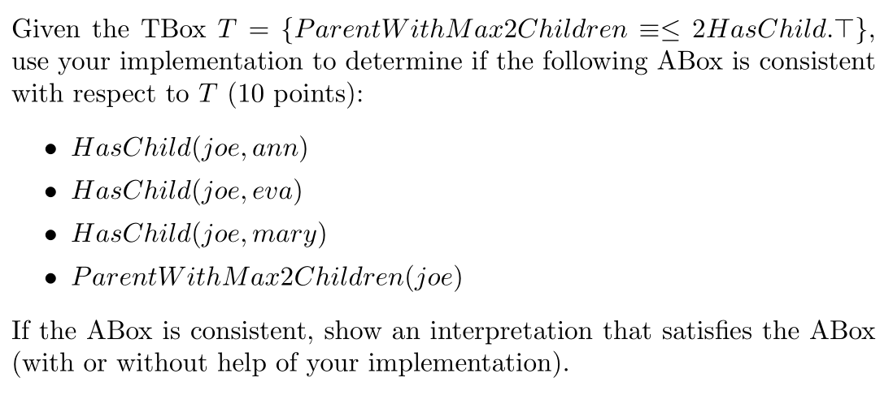

# Assignment 2: ALCQ

Zhirui Lu


Language: Python

Environment Requirement: Python 3.8+

> Note: Open the PDF/Markdown file in a reader that supports bookmark/outlining for easier navigation.

## File Structure

* `alcqObj.py`: All the classes for Description Logic of ALCQ, including `Constant`, `Concept`, `Assertions`, `ABox`, `TBox` and more.
* `alcq.py`: All ALCQ related functions, including tableau algorithm and rules, NNF conversion, subsumption check and more.
* `alcqTest.py`: Test cases for ALCQ. 
  * Also including cases from homework 2, particularly q3 and q4.


## Classes


## Run the program

You can either write your own Abox and Tbox,

1. Write new Abox and Tbox in `alcq.py`, under `if __name__=="__main__"` part. 
2. Run the program using `python3 alcq.py`.

Or use existing test cases.

1. Uncomment the cases you want to test in the `main ` function of `alcqTest.py`
2. Run the program using `python3 alcqTest.py`

Note that as the program outputs verbose results by default, it is recommended to only use one consistency / subsumption check invocation each time, otherwise it might be very hard to interpret the results.


## Using Your Own Inputs

1. Describe TBox using `PrimitiveConcept`, `DefinedConcept` and `Relation`

   > Note: As the concepts are defined by a tree, no explicit `TBox` is needed. The program will automatically build one for all the concepts and relations used.

   ```python
   Smart = PrimitiveConcept("Smart")
   Studious = PrimitiveConcept("Studious")
   attendBy = Relation("attendBy")
   
   # use Defined Concept for concepts with a definition
   GoodStudent = DefinedConcept("GoodStudent", And(Smart, Studious))
   
   topic = Relation("topic")
   # even use Top/Bottom
   Course = DefinedConcept("Course", Exists(topic, Top))
   
   lovedBy = Relation("love")
   hatedBy = Relation("hate")
   # and number restrictions (AtMost, AtLeast)
   LovedByAtMost3 = DefinedConcept("LovedByAtMost3", AtMost(3, lovedBy, Top))
   HatedByAtLeast2 = DefinedConcept("HatedByAtLeast2", AtLeast(2, hatedBy, Top))
   ```

2. Describe ABox using `Constant` and `Assertions`

   ```python
   a = Constant("a")
   s1 = Constant("Student 1")
   c1 = Constant("Course 1")
   
   good_student_assertion = GoodStudent(a)
   attend_by_assertion = attendBy(c1, s1)
   
   complex_assertion = And(Exists(attendBy, Smart), And(Exists(attendBy, Studious), Not(Exists(attendBy, GoodStudent))))(a)
   ```

3. For consistency check, wrap all the assertions in a `set` (representing abox) and run the tableau algorithm.

   > Note: Don't forget to call `process_abox`, otherwise the results might be incorrect. 

   ```python
   abox = {complex_assertion}
   run_tableau_algo(process_abox(abox))
   ```

4. For subsumption check, wrap the concepts into a `DefinedConcept`, then use the `is_subsumption_of` method.

   > Note: `is_subsumption_of(C, D)` checks if C ⊑T D 

   ```python
   c1 = DefinedConcept("c1", And(Exists(attendBy, Smart), Exists(attendBy, Studious)))
   c2 = DefinedConcept("c2", Exists(attendBy, GoodStudent))
   # should be false
   print("is subsumption?", is_subsumption_of(c1, c2))
   ```


## Interpreting Output

### Results

For results, only the last few lines are needed. 

```
# consistency, using the smart, studious, good student case
world overview:  4 [False, False, False, True]
final (consistency, true=open) verdict:  True
```

Here, after running the tableau algorithm, it ended with 4 aboxes, with 3 of them closed and 1 open. So the final verdict for consistency check is true.

```
# subsumption, homework 2 q3, a
world overview:  3 [False, False, False]
final (consistency, true=open) verdict:  False
is subsumption? True
```

Here we are using the `is_subsumption_of` method, which internally uses the tableau algorithm. After running the tableau algorithm, it ended with 3 aboxes and all of them are closed. This means the consistency is false, and the subsumption is true. 

### Internal Steps

For internal steps, reading the whole output is needed. Although it is verbose, there are still some visual cues that you can follow and help you understand what is happening faster.

#### General Structure

> Note: `World` here means an `ABox`, which is a set of assertions.

```
---initial----
Current Worlds:  1
[world detail]
[rule apply]
-------intermediate-----------
Current Worlds:  1
[world detail]
[rule apply]
-------intermediate-----------
Current Worlds:  2
[world detail]
[rule apply]
-------intermediate-----------
Current Worlds:  3
[world detail]
[rule apply]
-------intermediate-----------
Current Worlds:  4
[world detail]
-------final-----------
Worlds:  4
[world detail]
world overview:  4 [True, False, False, False]
final (consistency, true=open) verdict:  True
```

In general, there are 3 phases,

* `initial`: showing the abox directly from input
* `intermediate`: showing all the aboxes produced by the tableau algorithm
* `final`: after the tableau algorithm stopped, showing the remaining aboxes

#### World Detail

World detail part just shows all the aboxes currently generated, which the `len` indicating how many assertions in this abox, following the assertions listed and numbered.

```
0 len 13 ----
world 0 line 0 XA[Not(PC('Studious'))(CS('$1'))]
world 0 line 1 XA[ForAll(R('attendBy'), Or(Not(PC('Smart')), Not(PC('Studious'))))(CS('a'))]
<...>
1 len 13 ----
world 1 line 0 XA[Not(PC('Studious'))(CS('$1'))]
world 1 line 1 XA[ForAll(R('attendBy'), Or(Not(PC('Smart')), Not(PC('Studious'))))(CS('a'))]
<...>
2 len 13 ----
world 2 line 0 XA[Not(PC('Smart'))(CS('$1'))]
world 2 line 1 RA[R('attendBy'):(CS('a'),CS('$2'))]
<...>
3 len 13 ----
world 3 line 0 XA[Not(PC('Smart'))(CS('$1'))]
world 3 line 1 RA[R('attendBy'):(CS('a'),CS('$2'))]
<...>
```

#### Rule Apply

Before each `intermediate` output, there will be a `[rule apply]` output showing which rule is applied to which abox, containing which rule is applied to which abox, and the specific assertion that meet the rule requirement.

```
forall found XA[ForAll(R('attendBy'), Or(Not(PC('Smart')), Not(PC('Studious'))))(CS('a'))]
apply on world  0
rule! <function forall_rule at 0x000001DC6F877A60>
```


### An example: Homework 2, Problem 4



> Note: Uncomment `hw2q4()` from `main()` in `alcqTest.py` to follow along.

First, we need to describe the abox and tbox, then call the tableau algorithm.

```python
hasChild = Relation("HasChild")
ParentWithMax2Children = DefinedConcept("ParentWithMax2Children", AtMost(2, hasChild, Top))
joe = Constant("joe")
ann = Constant("ann")
eva = Constant("eva")
mary = Constant("mary")

abox = {hasChild(joe, ann), hasChild(joe, eva), hasChild(joe,mary),
ParentWithMax2Children(joe)}

run_tableau_algo(process_abox(abox))
```

Then we can check the output.

```
at most found XA[AtMost[2](R('HasChild'), Or(PC('$InternalA'), Not(PC('$InternalA'))))(CS('joe'))]
apply on world  0
rule! <function at_most_rule at 0x0000029E4886B310>
```

Here we can found rule for at most is triggered, which generates 3 world, combining different constants:

* ann/mary, eva
* ann/eva, mary
* eva/mary, ann

```
-------intermediate-----------
Current Worlds:  3
0 len 3 ----
world 0 line 0 XA[AtMost[2](R('HasChild'), Or(PC('$InternalA'), Not(PC('$InternalA'))))(CS('joe'))]
world 0 line 1 RA[R('HasChild'):(CS('joe'),CS('ann~mary'))]
world 0 line 2 RA[R('HasChild'):(CS('joe'),CS('eva'))]
1 len 3 ----
world 1 line 0 RA[R('HasChild'):(CS('joe'),CS('mary'))]
world 1 line 1 RA[R('HasChild'):(CS('joe'),CS('ann~eva'))]
world 1 line 2 XA[AtMost[2](R('HasChild'), Or(PC('$InternalA'), Not(PC('$InternalA'))))(CS('joe'))]
2 len 3 ----
world 2 line 0 XA[AtMost[2](R('HasChild'), Or(PC('$InternalA'), Not(PC('$InternalA'))))(CS('joe'))]
world 2 line 1 RA[R('HasChild'):(CS('joe'),CS('eva~mary'))]
world 2 line 2 RA[R('HasChild'):(CS('joe'),CS('ann'))]
```

And after these combinations, the aboxes are consistent.

```
world overview:  3 [True, True, True]
final (consistency, true=open) verdict:  True
```

Thus, for the abox to be consistent, possible interpretations are:

* Ann=Mary, or
* Ann=Eva, or
* Eva=Mary


## Internal Flow


